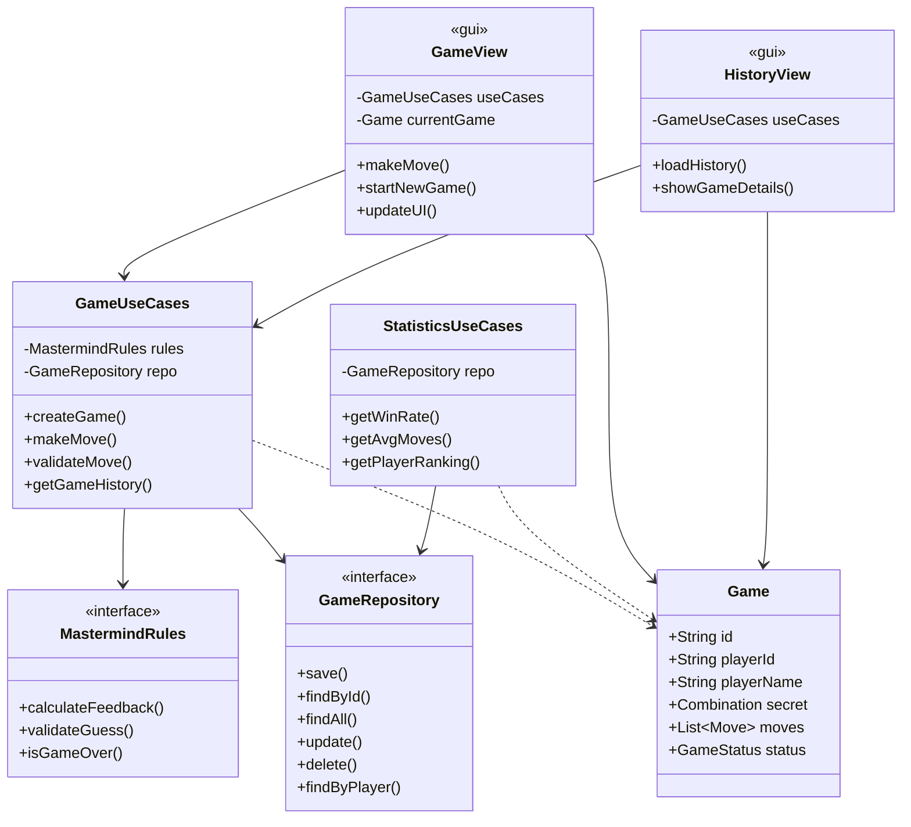
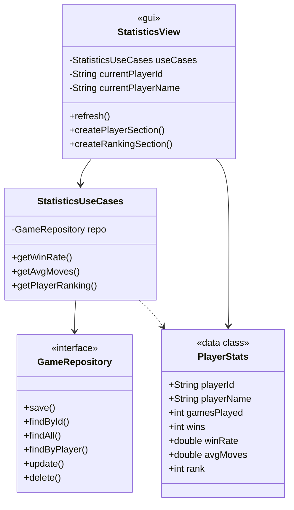
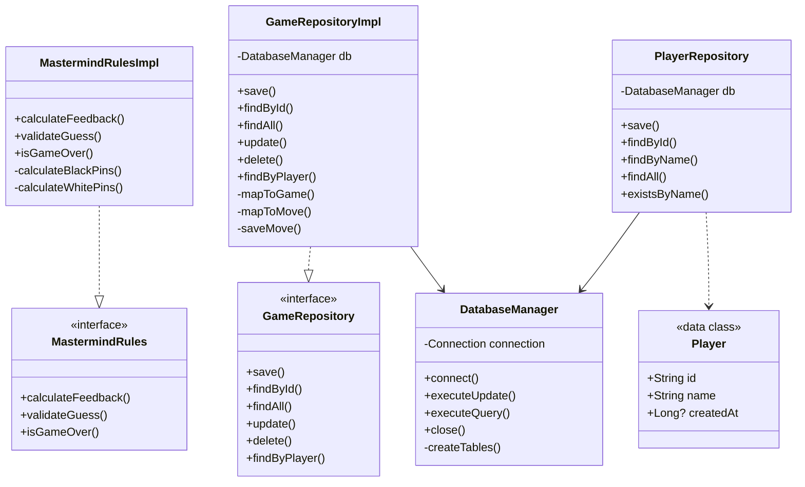

# Обновленная Архитектура приложения Mastermind

Приложение построено на принципах **Clean Architecture** (Чистая архитектура) с разделением на слои:

1. **Domain** — ядро бизнес-логики
2. **Application** — сценарии использования (Use Cases)
3. **Infrastructure** — реализации интерфейсов (БД, репозитории)
4. **GUI** — графический интерфейс (JavaFX)

## Диаграмма классов

# Class Diagram_1

# Class Diagram_2

# Class Diagram_3
