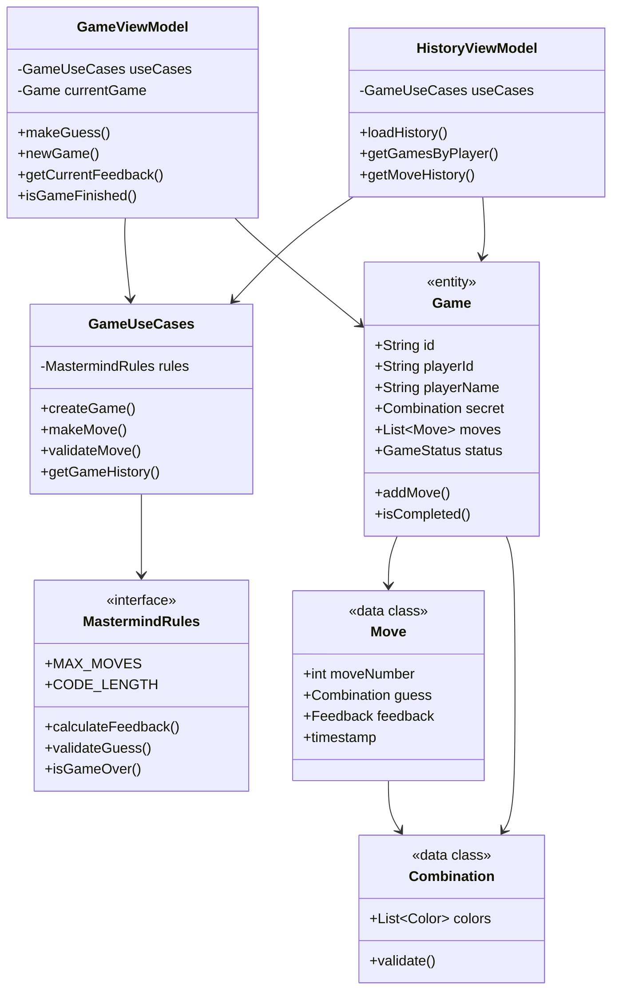
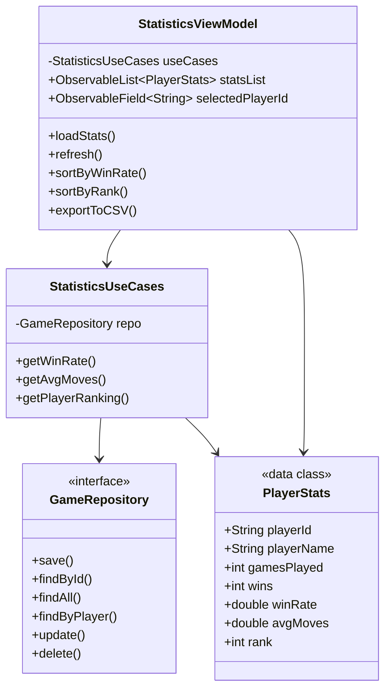
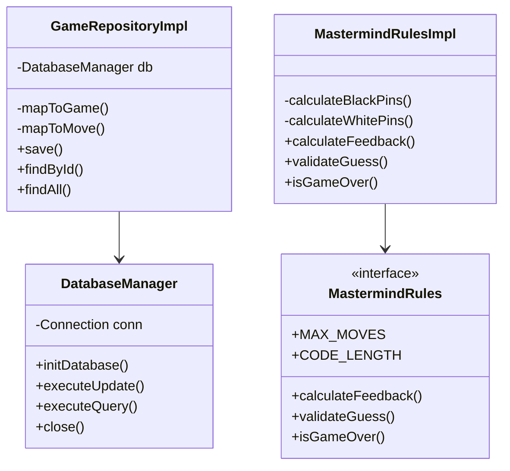

# Class Diagram - Mastermind Game
## Homework 1 - Architecture Design

## Class Diagram_1

```mermaid
classDiagram
    direction TB
    
    %% ============ DOMAIN ENTITIES ============
    class Combination {
        <<data class>>
        +List~Color~ colors
        +validate()
    }
    
    class Move {
        <<data class>>
        +int moveNumber
        +Combination guess
        +Feedback feedback
        +timestamp
    }
    
    class Game {
        <<entity>>
        +String id
        +String playerId
        +String playerName
        +Combination secret
        +List~Move~ moves
        +GameStatus status
        +addMove()
        +isCompleted()
    }
    
    %% ============ INTERFACE ============
    class MastermindRules {
        <<interface>>
        +calculateFeedback()
        +validateGuess()
        +isGameOver()
        +MAX_MOVES
        +CODE_LENGTH
    }
    
    %% ============ USE CASE ============
    class GameUseCases {
        -MastermindRules rules
        +createGame()
        +makeMove()
        +validateMove()
        +getGameHistory()
    }
    
    %% ============ VIEW MODELS ============
    class GameViewModel {
        -GameUseCases useCases
        -Game currentGame
        +makeGuess()
        +newGame()
        +getCurrentFeedback()
        +isGameFinished()
    }
    
    class HistoryViewModel {
        -GameUseCases useCases
        +loadHistory()
        +getGamesByPlayer()
        +getMoveHistory()
    }
    
    %% ============ СВЯЗИ ============
    Game --> Move
    Game --> Combination
    Move --> Combination
    GameUseCases --> MastermindRules
    GameViewModel --> GameUseCases
    GameViewModel --> Game
    HistoryViewModel --> GameUseCases
    HistoryViewModel --> Game
```

#
#

## Class Diagram_2

```mermaid
classDiagram
    direction TB
    
    %% ============ INTERFACES ============
    class GameRepository {
        <<interface>>
        +save()
        +findById()
        +findAll()
        +findByPlayer()
        +update()
        +delete()
    }
    
    %% ============ USE CASES ============
    class StatisticsUseCases {
        -GameRepository repo
        +getWinRate()
        +getAvgMoves()
        +getPlayerRanking()
    }
    
    %% ============ DTO ============
    class PlayerStats {
        <<data class>>
        +String playerId
        +String playerName
        +int gamesPlayed
        +int wins
        +double winRate
        +double avgMoves
        +int rank
    }
    
    %% ============ VIEW MODEL ============
    class StatisticsViewModel {
        -StatisticsUseCases useCases
        +ObservableList~PlayerStats~ statsList
        +ObservableField~String~ selectedPlayerId
        +loadStats()
        +refresh()
        +sortByWinRate()
        +sortByRank()
        +exportToCSV()
    }
    
    %% ============ СВЯЗИ ============
    StatisticsUseCases --> GameRepository
    StatisticsUseCases --> PlayerStats
    
    StatisticsViewModel --> StatisticsUseCases
    StatisticsViewModel --> PlayerStats
```
#
#

## Class Diagram_3

```mermaid
classDiagram
    direction TB
    
    %% ============ ИНТЕРФЕЙСЫ ============
    class MastermindRules {
        <<interface>>
        +calculateFeedback()
        +validateGuess()
        +isGameOver()
        +MAX_MOVES
        +CODE_LENGTH
    }
    
    %% ============ ИНФРАСТРУКТУРА (РЕАЛИЗАЦИИ) ============
    class DatabaseManager {
        -Connection conn
        +initDatabase()
        +executeUpdate()
        +executeQuery()
        +close()
    }
    
    class GameRepositoryImpl {
        -DatabaseManager db
        -mapToGame()
        -mapToMove()
        +save()
        +findById()
        +findAll()
    }
    
    class MastermindRulesImpl {
        -calculateBlackPins()
        -calculateWhitePins()
        +calculateFeedback()
        +validateGuess()
        +isGameOver()
    }
    
    %% ============ СВЯЗИ ============
    MastermindRulesImpl --> MastermindRules
    GameRepositoryImpl --> DatabaseManager
```
